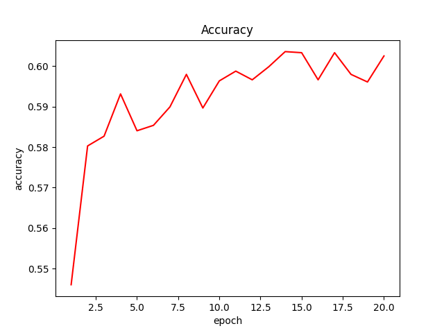
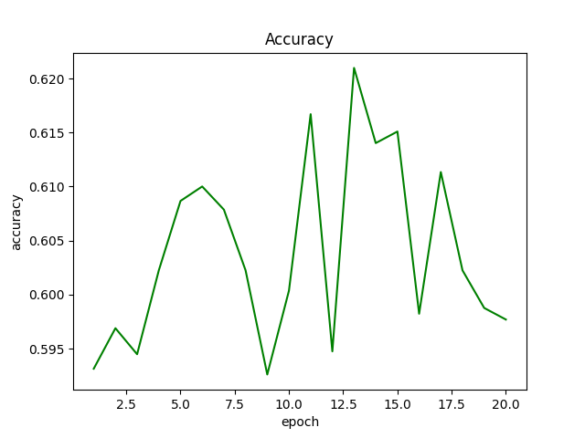
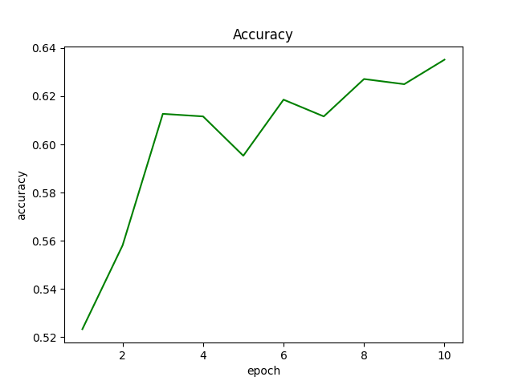
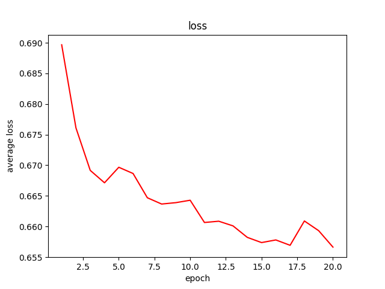
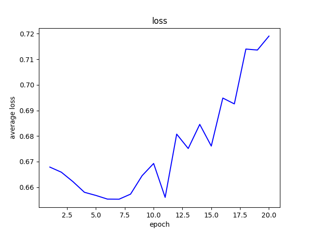
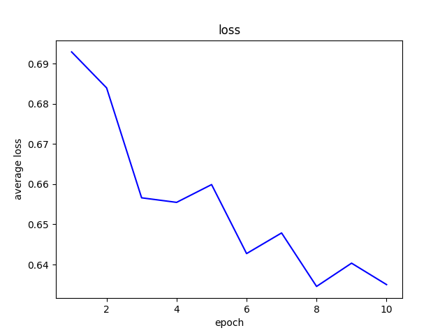

# NLI Lab #

## 主要工作 ##

1. 达成基本要求：用GloVe词嵌入，简单的LSTM模型，在TA提供的QNLI数据集上正确率达到55%  
2. 数据预处理：使用nltk和pandas进行数据词性还原，去除停用词等
3. 尝试解决过拟合：在模型中加入dropout层
4. 对比不同结构网络：基本LSTM，双向LSTM，BERT

## Get Started ##

### 创建虚拟环境(非必需) ### 

```shell
$ python -m venv EnvNLI
$ source EnvNLI/bin/activate
退出输入
$ deactivate
安装使用
$ pip install torchtext==0.6.0
```

### Run Code ###
- **依赖库**  
> torch==2.0.1  
> numpy==1.26.4  
> matplotlib==3.9.0  
> ntlk==3.8.1 (数据预处理)  
> pandas==2.2.2 (数据预处理)  
> scikit-learn==1.5.0 (/lstm)  
> tqdm==4.66.4 (/lstm)  
> torchtext==0.6.0 (/lstm)  

- **original**
运行可能需要修改部分文件夹路径  
能达成基本要求的代码，大致相同，在一些参数如Learning Rate有差别，实际上这个效果已经不错了  

- **optimized.py**
增加了一丢丢数据预处理和增加了网络参数，并引入了dropout层  
完整的数据预处理程序，使用ntlk库，在`data_process.py`  

- **/lstm**
一个框架，目前能跑，但只是能跑而已，准确率...

- **Bert**
本地性能不够，拿去colab跑  
十几分钟一个epoch，但是准确率劲爆，3个epoch38分钟跑到90%的正确率，具体见BERT.ipynb吧      

### 什么是Bert? ###

- 概述：self-surpervised模型，是拥有340M参数的巨大模型，但比GPT还是小很多的，常用于自然语言和语音处理    
- self-surpervised的Pre-train: 无label，想办法做surpervised。如Masking随机盖住句子的部分，或随机换某个字；而盖起来或者换的是什么是知道的，变成了surpervised的classification。又如Next Sentence Prediction，随机取两个连接的句子s1,s1，然后得到`[CLS] + s1 + [SEP] + s2`，作为输入进行训练    
- 使用Bert(其中为Transformer Encoder，包括残差网络、正则化、自注意力机制等) + Linear Layer
- 然后可以迁移到各式下游任务(Downstream Tasks)，Fine-tune(有labels的训练)一下就行，可以做的任务包括QNLI和WNLI。在下游任务中用Bert + Linear做Gradient Decent，Bert的参数的初始值是经过pre-train的，Linear初始值是随机的。
- 从头训练TPU 8天，colab可能一年，但微调colab半个钟左右就好

> 参考NTU ML Course：https://www.youtube.com/watch?v=e422eloJ0W4&list=PLJV_el3uVTsMhtt7_Y6sgTHGHp1Vb2P2J&index=18

## Result ##
- original：
lr设为1e-4不会有过拟合  
lr设为1e-3可以产生较好的准确率，但是有点过拟合，20个epoch训练集能到70%，验证集就差些  
lr设为1e-2依托答辩从头到尾的准确率在50%左右，二选一50%是什么概念  

- optimized
较慢，差不多2min一个epoch，可以看到10个epoch下来是能到62%的，比original高了2%左右

下图是验证集的正确率和Loss  

<table border="0" cellspacing="0" cellpadding="0">
  <tr>
    <td align="center"><b>Origin Lr=1e-4</td>
    <td align="center"><b>Origin Lr=1e-3</td>
    <td align="center"><b>Optimized</td>
  <tr>
    <td> </td>
    <td> </td>
    <td> </td>
  </tr>
  <tr>
    <td> </td>
    <td> </td>
    <td> </td>
  </tr>
</table>
- Bert结果请参看BERT.ipynb

## Limitaion ##
- 有待理解的结果
    1. `data_process.py`的数据预处理让模型表现更差，基本从头到尾的准确率在50%左右
    2. `/lstm`的表现也是基本从头到尾的准确率在50%左右
    3. original highLr.py加入dropout作用不大  
- 在自己ubuntu虚拟机用CPU跑的，非常慢所以没有进行充分调参

## Reference ##
lstm:  https://blog.csdn.net/qq_52785473/article/details/122800625
关于Bert leedl-tutorial: https://www.youtube.com/playlist?list=PLJV_el3uVTsMhtt7_Y6sgTHGHp1Vb2P2J
更多Bert资料 https://github.com/datawhalechina/leedl-tutorial/tree/master/Homework/HW7_Bert