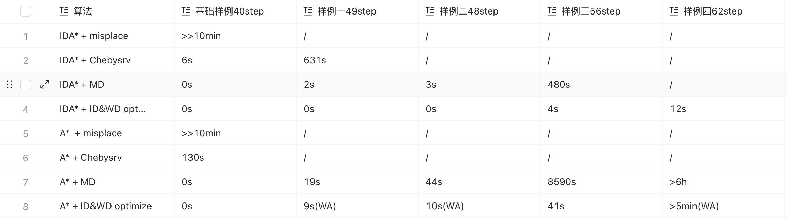

# Heuristic Search Lab #

## code ##

- 正常搓个`A*`和`IDA*`应该能过基本的，几个比较大的样例就很吃力。曼哈顿距离应该比较明显是课堂上说的几个里面最优的，但是跑最后两个大样例也要大几个小时，`A*`的话可能爆内存，跑这个是比较痛苦的。  
- 然而老师给的程序几秒钟就跑出来了，怎么做到的呢？直接看它的[源码](https://computerpuzzle.net/english/15puzzle/index.html)吧，还有一些[相关的](https://kociemba.org/themen/fifteen/fifteensolver.html)   
这里用到的启发式函数(WD+ID)确实显著提升了搜索效率，但是要复现有一定难度。原求解器是(WD+ID)的`IDA*`，之前修改(WD+ID)的`A*`版本尝试失败了，源码就不附上了    
- 展示一下参考运行时间  
